> 추후 포멧 혹은 새로 맥북을 구매할 때를 대비하여 초기 설정에 대한 기록을 남김

# 설정

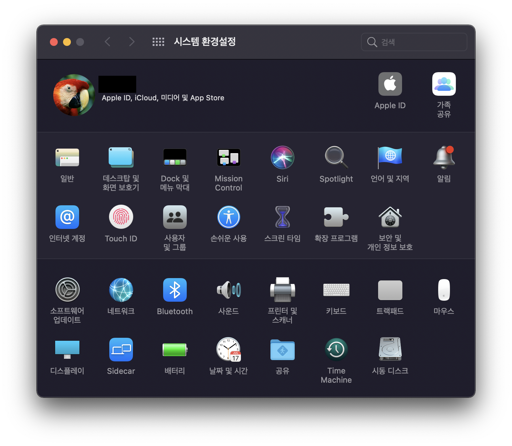

## Apple ID

> iCloud 연동하는 옵션을 끄기 위한 목적이다.

개인적으로 연동되는 것을 좋아하지 않기 때문에 다 꺼두는 편이다.
다만, 혹시나 하는 마음에 **"나의 Mac 찾기"** 옵션은 켜두었다.

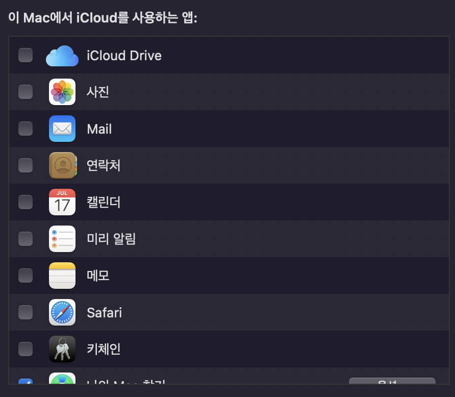

## 데스크탑 및 화면 보호기

> 아무 효과도 없는 것 같지만 화면 보호기가 켜지지 않도록 설정했다.

**다음 이후에 화면 보호기 보기** 해제

## Dock 및 메뉴 막대

> Dock 자동 가리기, 크기 조정, 메뉴 바 설정 등

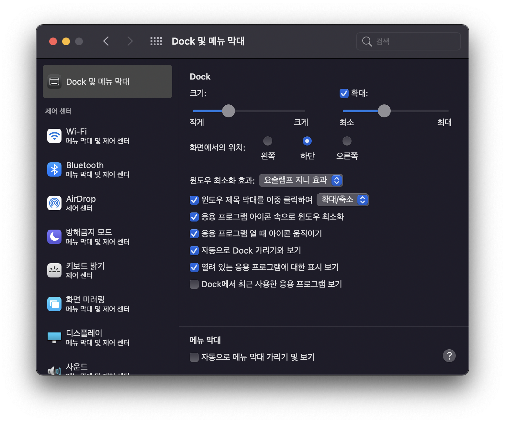

- **Wi-Fi**
  - [x] 메뉴 막대에서 보기
- **Bluetooth**
  - [x] 메뉴 막대에서 보기
- **AirDrop**
  - [ ] 메뉴 막대에서 보기
- **사운드**
  - [x] 메뉴 막대에서 보기 (항상)
- **손쉬운 사용 단축키**
  - [ ] 메뉴 막대에서 보기
  - [x] 제어 센터에서 보기
- **배터리**
  - [x] 메뉴 막대에서 보기
  - [ ] 제어 센터에서 보기
  - [x] 퍼센트 보기
- **Spotlight**
  - [ ] 메뉴 막대에서 보기
- **Siri**
  - [ ] 메뉴 막대에서 보기
- **Time Machine**
  - [ ] 메뉴 막대에서 보기

## Siri

> 시리한테 말할 일이 없어서.. 사용하지 않음

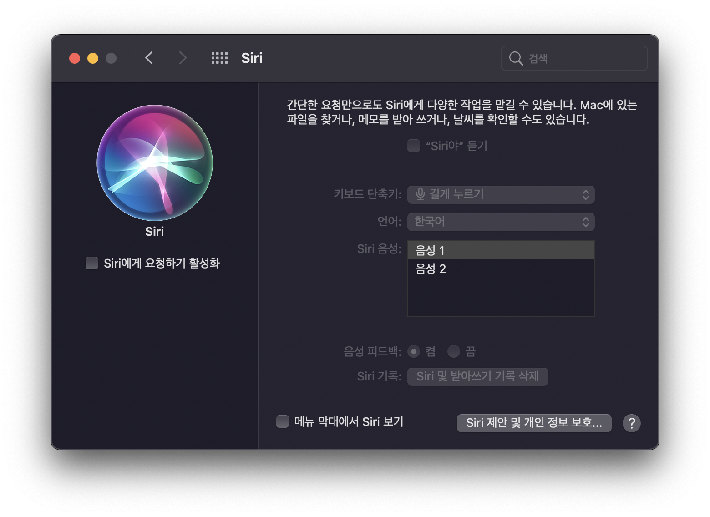

## 언어 및 지역

> 선호하는 언어 순서대로 UI에 표현되는 언어가 결정되므로 편하게 설정

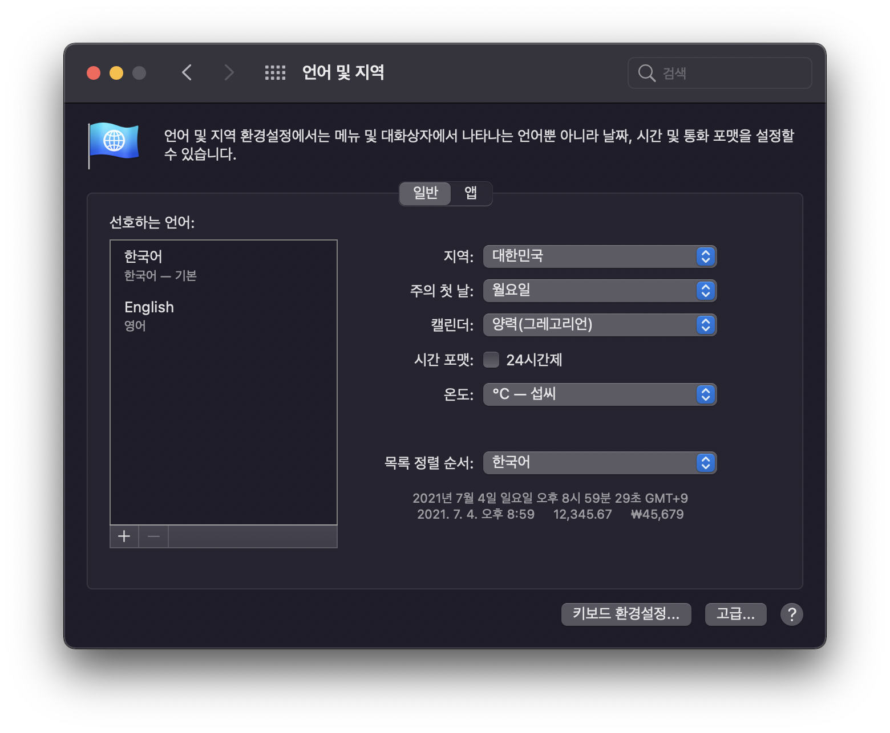

## 인터넷 계정

> 메일 / 캘린더 등에 연결할 계정 추가

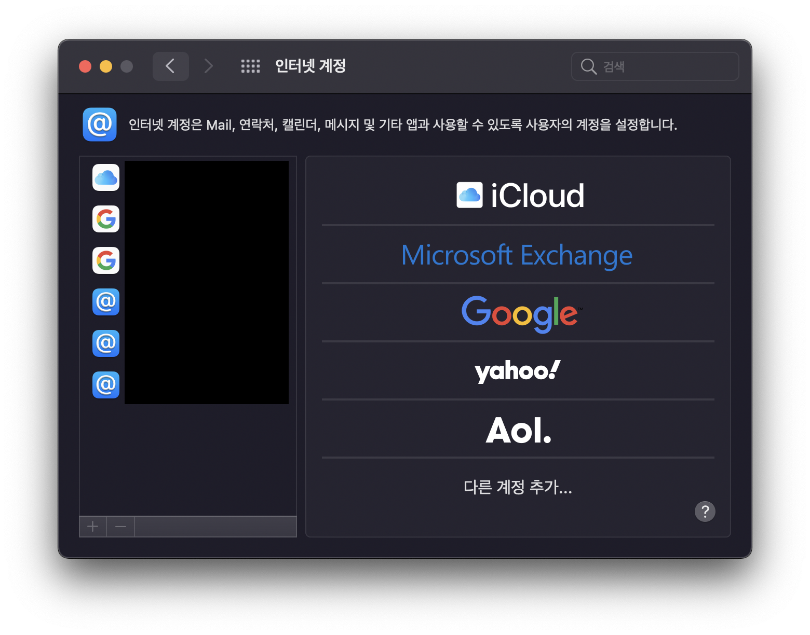

## 손쉬운 사용

> 하단 **메뉴 막대에서 손쉬운 사용 상태 보기** 체크 해제

- **VoiceOver** : 사용하지 않음
- **확대/축소**
  - [ ] 키보드 단축키를 사용하여 확대/축소
  - [x] 확대/축소하려면 스크롤 제스처를 다음 보조 키와 함께 사용: ^ Control
  - [ ] 텍스트 표시 활성화
- **디스플레이**
  - [x] 커서 > 마우스 포인터를 흔들어 찾기
  - 그 외에는 모두 사용하지 않음
- **콘텐츠 말하기** : 기본값
- **설명** : 모두 사용하지 않음
- **오디오** : 모두 사용하지 않음
- **자막** : 모두 사용하지 않음
- **음성 명령** : 모두 사용하지 않음
- **키보드** : 모두 사용하지 않음
- **포인터 제어기**
  - [x] 자동 열림 지연 시간 : 중간
  - 그 외에는 모두 사용하지 않음
  - 트랙패드 옵션과 마우스 옵션은 기본값 사용
- **스위치 제어** : 사용하지 않으며 그 외에는 모두 기본값
- **Siri** : 모두 사용하지 않음
- **단축키** : 모두 사용하지 않음

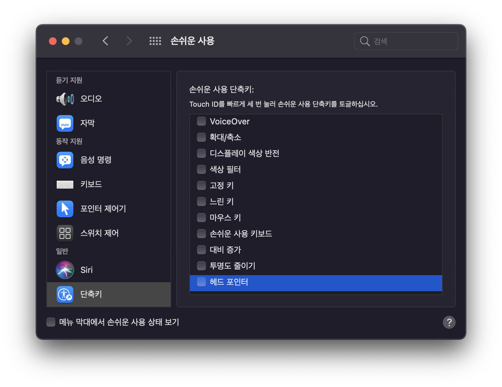

## 스크린 타임

> 이 맥의 스크린 타임 : 끔

## 보안 및 개인 정보 보호

- **FileVault** : 켜기
- **방화벽** : 켜기
- **개인 정보 보호**
  - **위치 서비스**
    - [x] 위치 서비스 활성화
      - [x] 미리 알림
      - [ ] Siri 및 받아쓰기
      - [ ] Google Chrome
      - 시스템 서비스 : 전체 사용
  - **전체 디스크 접근 권한** : 개발용 앱들 추가
  - **분석 및 향상** : 전체 사용하지 않음

## 네트워크

> 하단 **메뉴 막대**에서 Wi-Fi 보기 : 체크

## Bluetooth

> 하단 **메뉴 막대**에서 Bluetooth 보기 : 체크

## 사운드

> 하단 **메뉴 막대**에서 음량 보기 : 체크

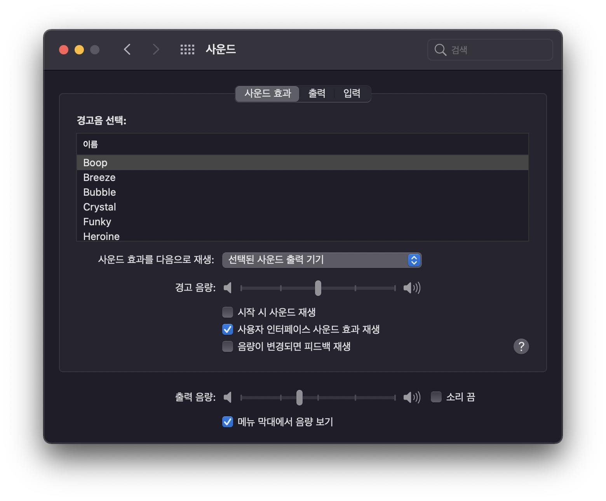

## 키보드

> 일부는 이미지로 대체함  
> 하단 **키보드 탐색을 사용하여 컨트롤 간에 초점 이동** : 선택하지 않음

**키보드**

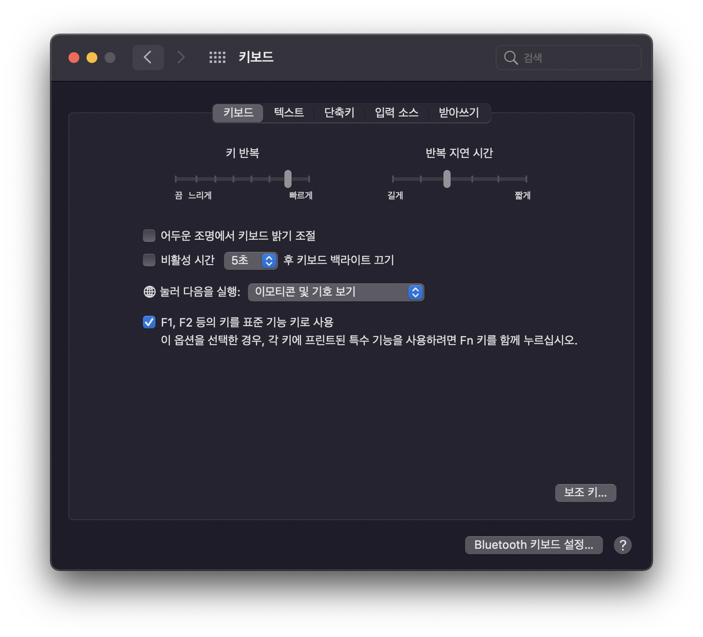

**텍스트**

참고로, 인용 부호들은 각각 가장 하단 항목을 선택하였음

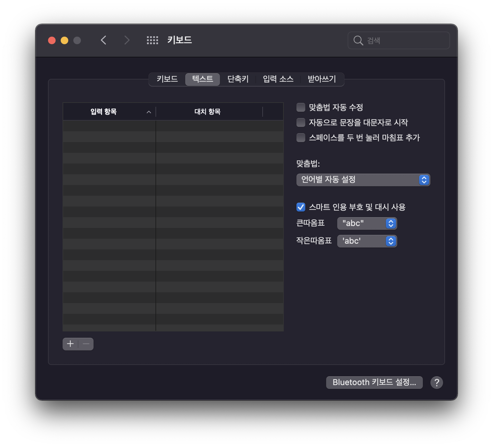

**단축키**

- **Launchpad 및 Dock** : 모두 사용 안함
- **Mission Control**
  - [x] Mission Control
  - [ ] 알림 센터 보기
  - [x] 방해금지 모드 켬/끔
  - [x] 응용 프로그램 윈도우
  - [x] 데스크탑 보기
  - [x] Mission Control
    - [x] 왼쪽으로 Space 이동
    - [x] 오른쪽으로 Space 이동
    - [ ] 데스크탑 1로 전환
    - [ ] 데스크탑 2로 전환
    - [ ] 데스크탑 3으로 전환
- **키보드** : 모두 사용
- **입력 소스** : 모두 사용 안함
- **스크린샷** : 모두 사용
- **서비스** : 단축키가 없더라도 사용할 항목들은 모두 선택/해제
- **Spotlight** : 모두 사용
- **손쉬운 사용** : 모두 사용하지 않음
- **앱 단축키** : 알아서 커스터마이징

**입력 소스**

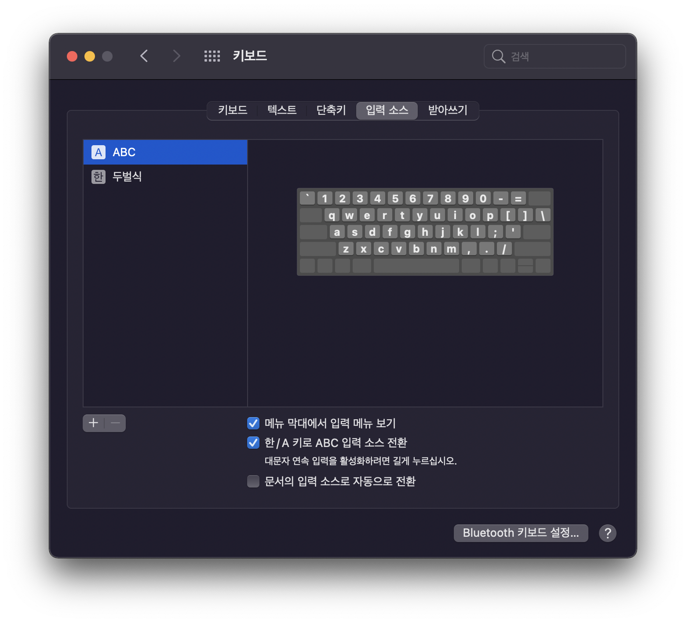

**받아쓰기** : 끔

## 트랙패드

> 첨부한 이미지 외에는 모두 사용함

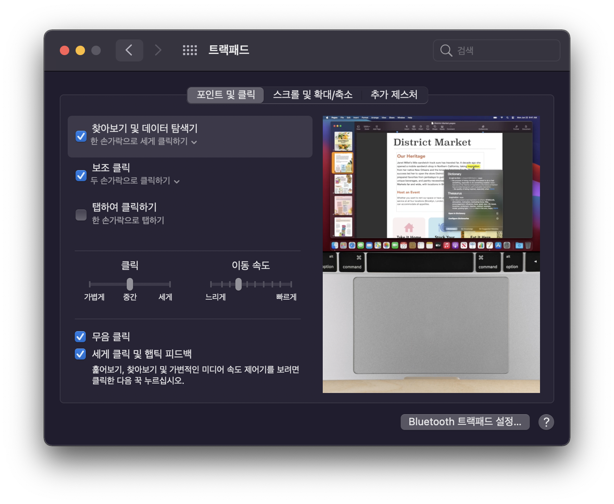

## 디스플레이

> 첨부한 이미지 외에는 모두 기본값

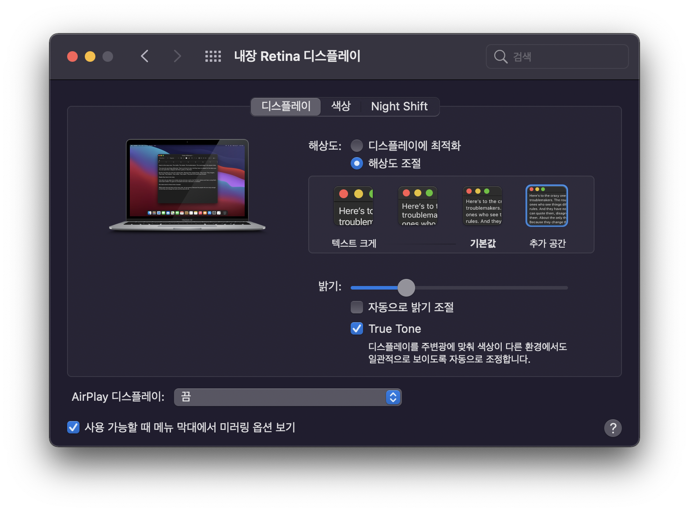

> 별다른 설정 없이, **메뉴 막대에서 배터리 상태 보기** 항목을 켬

## 공유

> 컴퓨터 이름은 원하는대로 설정한 후, 서비스 항목들은 모두 사용하지 않음

## Time Machine

> 백업 디스크는 **Disk Utility**를 이용하여 파티션을 분리한 후 선택하였음  
> 따로 백업할 항목들은 많지 않으며, 대부분 깃(Git)으로 관리되므로 굳이 외부 디스크를 사용하지 않음
