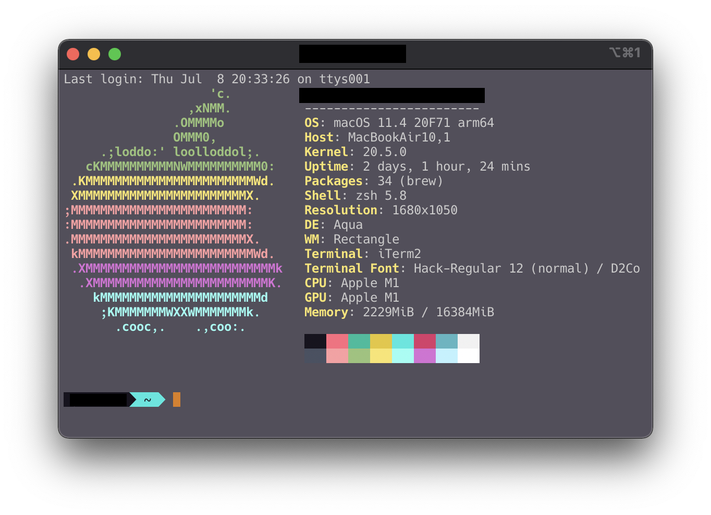
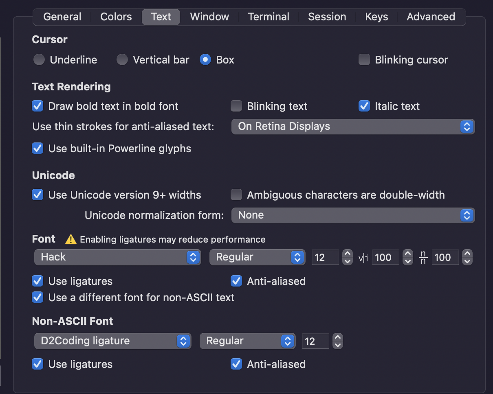

# 설치한 앱 전체 목록

> App Store : \*

- 카카오톡 \*
- Slack \*
- Amphetamine \*
- Keynote \*
- ColorSlurp \*
- Xcode \*
- Microsoft Remote Desktop \*
- [Homebrew](https://brew.sh)
- [Docker](https://www.docker.com/products/docker-desktop)
- [Keka](https://www.keka.io)
- [IntelliJ IDEA](https://www.jetbrains.com/idea/download/#section=mac)
- [Tunnelblick](https://tunnelblick.net)
- [Visual Studio Code](https://code.visualstudio.com/Download)
- iTerm2
  - zsh
  - zsh-syntax-highlighting
- CheatSheet
- Google Chrome
- Rectangle
- pyenv
- pipenv
- nvm

---

# iTerm2



```shell
brew install iterm2 zsh zsh-syntax-highlighting
```

## 색상 테마 변경하기

> 다음 링크로 이동하여 색상 테마를 고른다  
> 참고로 내가 설치했던 테마는 **Banana Blueberry**임

[색상 테마 고르기](https://iterm2colorschemes.com)

```shell
mkdir ~/.iterm2_theme # 테마를 다운로드 받을 디렉토리 생성
cd ~/.iterm2_theme # 해당 디렉토리로 이동
curl -LO https://raw.githubusercontent.com/mbadolato/iTerm2-Color-Schemes/master/schemes/Banana%20Blueberry.itermcolors # 다운로드
```

**1. 색상 적용을 위해서 iterm2를 실행한 뒤**  
Preferences > Profiles > Colors > Color Presets...(우측 하단) > **Import**

**2. Finder에서 테마를 다운로드 받은 디렉토리로 이동**  
숨김 파일 보기 - `Command + Shift + .`

**3. 테마 선택**

## 터미널 테마 변경하기

> 테마 목록은 [여기](https://github.com/ohmyzsh/ohmyzsh/wiki/Themes)서 확인할 수 있음


**1.** `vi ~/.zshrc`  
**2. ZSH_THEME 값 수정**

```shell
# Set name of the theme to load --- if set to "random", it will
# load a random theme each time oh-my-zsh is loaded, in which case,
# to know which specific one was loaded, run: echo $RANDOM_THEME
# See https://github.com/ohmyzsh/ohmyzsh/wiki/Themes
ZSH_THEME="agnoster"
```

Agnoster 테마는 처음 설치 시 폰트가 깨지므로 별도의 폰트를 설치해야 하므로 [Powerline fonts](https://github.com/powerline/fonts)에서 깨지지 않는 폰트를 다운로드하여 설치한다.

맥에서의 폰트 설치는 폰트 파일을 더블 클릭하여 설치하면 되는데, 난 맥을 처음써봐서 그것도 모르고 `~/Library/Fonts` 경로에 폰트 파일을 옮기는 방식으로 설치했다.

난 좋아하는 폰트인 **Hack** 폰트를 설치하였고, [D2Coding](https://github.com/naver/d2codingfont) 폰트를 별도로 다운로드 받아서 iTerm2의 폰트로 지정하였다.



## 표시되는 이름 변경하기

보통 `.zshrc` 파일에서 변경 처리를 하는 것 같지만, 나는 뜻대로 되지 않아서 그냥 **agnoster** 테마 자체를 변경하였다.

```shell
cd ~/.oh-my-zsh/themes # 테마 폴더로 이동
vi agnoster.zsh-theme # agnoster 테마 수정
```

내부에서 `prompt_context` 부분을 찾아 다음과 같이 수정한다.

```shell
# Context: user@hostname (who am I and where am I)
prompt_context() {
  if [[ "$USERNAME" != "$DEFAULT_USER" || -n "$SSH_CLIENT" ]]; then
    prompt_segment black default "%(!.%.)%n"
    # prompt_segment black default "%(!.%.)%n@%m"
  fi
}
```

## 실행 시 애플 로고와 시스템 정보 표시

iTerm2 실행 시 애플 로고와 함게 시스템 정보를 표시하는 것은 [neofetch](https://github.com/dylanaraps/neofetch)를 이용하면 된다.

먼저, Homebrew를 이용하여 간단하게 설치를 진행한다.

```shell
brew install neofetch
```

이후, 시작 시 **neofetch**가 실행 될 수 있도록 **.zshrc** 파일에 다음 내용을 추가한다.

```shell
# Show system info
neofetch
```

---

# Homebrew를 이용한 설치

검색

```shell
brew search APP_TO_FIND
```

설치

```shell
brew install APP_TO_INSTALL
brew install --cask CASK_APP_TO_INSTALL
```
