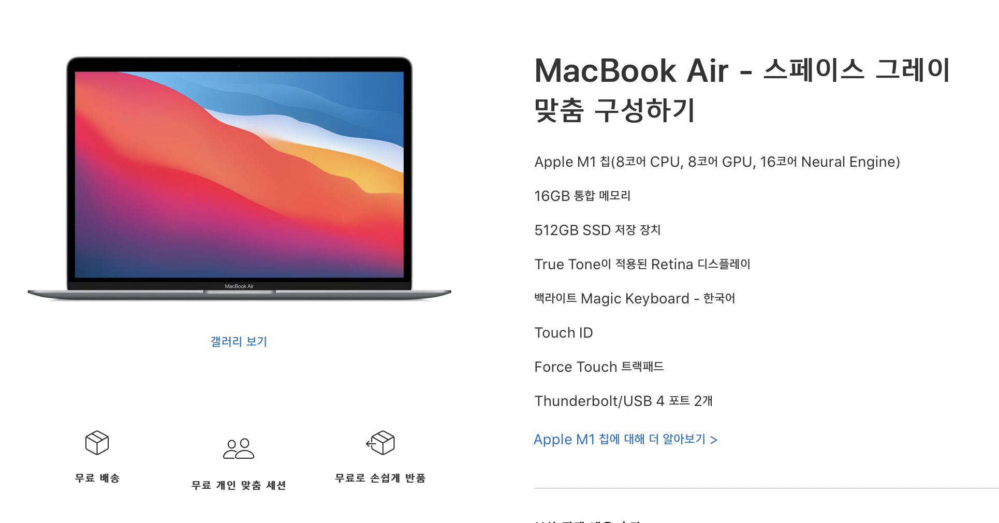

# 맥북 에어 M1

> 내 첫 맥북은 **맥북 에어 M1**이다.

맥북 에어는 깡통이 제일 좋은 선택인 것 같지만, 나는 [맥북 에어 M1](<https://www.apple.com/kr/shop/buy-mac/macbook-air/스페이스-그레이-apple-m1-칩(8코어-cpu-및-8코어-gpu)-512gb#>) (8코어 / RAM 16GB / SSD 512GB) 사양으로 구매하였다.

앞으로 이 카테고리에는 추후 맥북을 교체할 때에 대비하여 내가 어떻게 세팅했었는지와, 단축키나 몇 가지 잊어버릴 법한 팁들을 적으려고 한다.

# 구매 이유

> 먼저, 내가 노트북을 구매할 때 고려하는 사항은 다음과 같다.

- **노트북은 어디까지나 휴대용 기기이므로 무조건 가벼워야 한다.**
- **베젤이 두껍지 않아야 한다.**
- **배터리는 가급적 오래가면 좋다.**
- **램은 16GB, 용량은 512GB이면 충분히 사용한다.**
- **위 사양에 가격이 합리적이어야 한다.**
- **쿨링 성능이 좋아야 한다.**
- **가급적 120Hz 주사율을 지원하면 좋다.**

위의 기준을 맥북 에어 M1은 충분히 만족하였고, 애플 실리콘 1세대인 점은 좀 두렵지만 후회되지 않는 선택이었다. 배터리 성능과 기타 성능 향상 대비 가격이 충분히 합리적이라고 느끼게 했다. (사실 결코 가성비가 좋다고 생각하지는 않는다.)

위 기준들을 맥북 에어 M1에 대입해보면,

- [x] **노트북은 어디까지나 휴대용 기기이므로 무조건 가벼워야 한다.**

사실 가급적 노트북은 1.1Kg 내에서 구매하려고 하는 편인데, 맥북은 그런 선택지가 없다. 맥북 에어가 그나마 가벼우니 조건을 충족하였다고 봤다.

- [ ] **베젤이 두껍지 않아야 한다.**

베젤은 전혀 얇지 않다. 두껍다. 거기에 촌스럽기까지 했다면 구매를 망설였을 수 있다. 하지만 베젤이 두꺼운 것에 비해 촌스러워 보이지는 않았다.

- [x] **배터리는 가급적 오래가면 좋다.**

배터리는 정말 오래간다. 배터리가 오래간다는 노트북들을 구매해봤지만, 개발을 하다보면 어느새 배터리가 부족하여 항상 충전기를 들고 다니고 카페에 가면 콘센트가 있는 자리를 찾아 다녔다.
하지만 M1 에어는 그럴 필요가 없었다. 아주 많이 굴리는 작업이 아니라면 충전기 없이도 오랜 기간 부족함 없이 작업할 수 있었다.

- [x] **램은 16GB, 용량은 512GB이면 충분히 사용한다.**
- [x] **위 사양에 가격이 합리적이어야 한다.**

맥북은 윈도우 노트북에 비해 같은 사양임에도 가격이 세다. 사실 삼성이나 LG 노트북도 가격이 저렴하다고는 생각하지 않는데 맥북은 항상 가격이 세다는 생각을 갖고 살았다. 항상 가격이 세다는 생각을 가지고 있으니 [맥북 에어 M1 (8코어 / 16GB / 512GB)](<https://www.apple.com/kr/shop/buy-mac/macbook-air/스페이스-그레이-apple-m1-칩(8코어-cpu-및-8코어-gpu)-512gb#>)의 가격은 생각보다 합리적인 가격이라고 생각했다.

- [x] **쿨링 성능이 좋아야 한다.**

쿨링 성능이 좋아야 한다는 것에는 키보드를 칠 때 뜨겁지 않아야 하는 것과 팬의 소리가 크지 않아도 충분히 쿨링이 되야한다는 것이다. 그런 점에서 맥북 에어 M1은 미쳤다. '어.. 곧 뜨거워지나?' 생각이 들 때도 '뭐지 왜 더 안뜨거워지지?' 할 정도로 뜨거워지는 일도 없는데 팬도 없으니 정말 정숙하다.

- [ ] **가급적 120Hz 주사율을 지원하면 좋다.**

사실 구매를 망설이게 했던 가장 큰 이유가 120Hz의 지원이었다. 최근 120Hz에 눈이 익숙해진 뒤로 60Hz는 불편하게 느끼고 있다. 이 이유 때문에 정말 많이 고민했다. 하지만 다른 부분들이 너무 우수하므로 그냥 구매하기로 결정했다.

## 구매가 너무 늦지 않았나?

사실 너무 늦게 구매하였다고 생각할 수 있는데, 원래는 다가올 **M2(M1X ?) 맥북 프로 14/16**인치를 구매하려 하였다. 하지만 공개하는 것을 기다리고 기대했던 애플의 WWDC2021에서 신제품에 대한 이야기는 없었고, 이는 곧 내가 M1 맥북 에어 구매 이유를 찾게하였다.

# 결론

> 너무 낭만적이네요.. 이 질감, 배터리, 속도.

