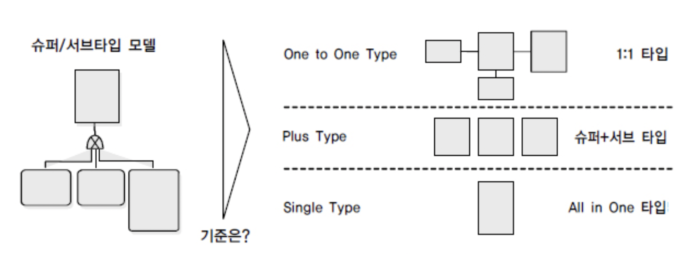

데이터 모델링을 어떻게 하는지에 따라 성능이 달라진다.
따라서 논리적인 모델을 물리 데이터 모델로 변환할 때는 트랜잭션 특성 등을 고려하여 설계해야 한다.
또한 인덱스 특성을 고려한 설계도 중요하다.

# 트랜잭션 특성을 고려한 설계

이 내용은 자주 쓰이는 모델링 방법 중 Entended ER 모델이라고 부르는 슈퍼/서브타입 데이터 모델을 기준으로 설명한 것이다.

## 슈퍼/서브 타입 데이터 모델

> 데이터의 특징을 공통 부분(슈퍼)과 차이점 부분(서브)을 나누어 효과적으로 표현



슈퍼/서브 타입 모델의 성능이 저하되는 경우는 다음과 같이 정리할 수 있다.

- 트랜잭션은 항상 일괄로 처리하는데 테이블은 개별로 유지되어 Union 연산 시 성능 저하
- 트랜잭션은 항상 서브타입 별로 처리하는데 테이블은 하나로 통합되어 불필요하게 많은 양의 데이터가 집약되어 성능 저하
- 트랜잭션은 항상 슈퍼+서브 타입을 공통으로 처리하는데 개별로 유지되어 있거나 하나의 테이블로 집약되어 있어 성능 저하

물리 데이터 모델로 변환할 때는 가급적 1:1 관계를 유지하는 것이 바람직하나 데이터 용량이 많아지는 경우나 성능에 민감한 경우는 상황에 맞게 변환하도록 해야 한다.

## 슈퍼/서브 타입 데이터 모델의 변환기술

1. 개별로 발생되는 트랜잭션에 대해서는 개별 테이블로 구성
2. 슈퍼타입+서브타입에 대해 발생되는 트랜잭션에 대해서는 슈퍼타입+서브타입 테이블로 구성
3. 전체를 하나로 묶어 트랜잭션이 발생할 때는 하나의 테이블로 구성

## 슈퍼/서브타입 데이터 모델의 변환타입 비교

| 구분       | OneToOne Type    | Plus Type              | Single Type   |
| ---------- | ---------------- | ---------------------- | ------------- |
| 특징       | 개별 테이블 유지 | 슈퍼 + 서브타입 테이블 | 하나의 테이블 |
| 확장성     | 우수함           | 보통                   | 나쁨          |
| 조인성능   | 나쁨             | 나쁨                   | 우수함        |
| I/O량 성능 | 좋음             | 좋음                   | 나쁨          |
| 관리용이성 | 좋지않음         | 좋지않음               | 좋음          |

---

# 인덱스 특성을 고려한 PK/FK 데이터베이스 성능향상

> **인덱스**  
> 데이터를 조회할 때 가장 효과적으로 처리될 수 있도록 접근 경로를 제공하는 오브젝트

일반적으로 데이터베이스 테이블은 B\* Tree구조를 많이 사용한다.
PK/FK는 데이터를 접근할 때 경로를 제공하는 성능의 측면에서도 중요한 의미를 가지므로 설계 단계 말에 **트랜잭션의 조회 패턴에 따라 컬럼의 순서를 조정**할 필요가 있다.

PK는 유니크 인덱스(Unique Index)를 모두 자동 생성한다.

- 인덱스 특징
  - 복합 속성 인덱스는 앞쪽 속성이 비교자로 있을 때 효율적임
  - 조건절에서 앞쪽 속성은 가급적 `=` 아니면 최소한 범위 `BETWEEN < >`

FK도 데이터를 조회할 때 조인의 경로를 제공하는 역할을 수행하므로 FK에 대해서는 반드시 인덱스를 생성한다.

## 인덱스 컬럼의 순서가 중요한 이유

> 인덱스 컬럼은 자주 사용되는 트랜잭션과 데이터 특성에 맞추어 순서를 조정해주어야 하며, 그에 따라 SQL문도 적절히 작성해야 함

다음과 같이 인덱스가 생성되었다고 하자.

```sql
CREATE UNIQUE INDEX IDX_ORDER ON 주문목록 (
  주문번호 ASC,
  주문일자 ASC,
  주문번호코드 ASC
)
```

해당 인덱스에 의해 인덱스는 **주문번호 → 주문일자 → 주문번호코드** 순으로 정렬된다.
이러한 이유로 **주문번호부터 조건을 걸고 조회를 해야 제대로 인덱스를 이용**할 수 있는 것이다.

주문번호를 기준으로 주문일자가 정렬된 것이므로 주문번호 없이는 찾고자 하는 주문일자가 어디있는지 모를 것이므로 옵티마이저는 차라리 테이블 전체를 읽는 방식으로 처리한다.

정의된 인덱스를 제대로 활용할 수 있도록 조회 조건을 잘 사용하는 것도 중요하지만, 데이터의 특징을 파악하여 **조회 범위를 좁혀주는 쪽으로 인덱스 컬럼 순서를 조정**하는 것도 중요하다.

예를 들어, 다음 2가지 경우를 생각해보자. 현금 출급기 실적에는 약 1000일 간의 데이터가 있다고 가정한다.

```sql
-- A. 거래일자 → 사무소코드 순
CREATE UNIQUE INDEX IDX_A ON 현금출급기실적 (
  거래일자 ASC,
  사무소코드 ASC
);

SELECT 건수, 금액
FROM 현금출급기실적
WHERE 거래일자 BETWEEN '20210828' AND '20210829'
  AND 사무소코드 = '001';

-- ================================

--B. 사무소코드 → 거래일자 순
CREATE UNIQUE INDEX IDX_B ON 현금출급기실적 (
  사무소코드 ASC,
  거래일자 ASC
);

SELECT 건수, 금액
FROM 현금출급기실적
WHERE 사무소코드 = '001'
  AND 거래일자 BETWEEN '20210828' AND '20210829';
```

1. **사무소 개수가 30개인 경우**
   - IDX_A : **바람직함**
     - 거래일자 별로 30개 사무소가 있으니 위 SQL문은 2(일) x 30(사무소) = 60개의 인덱스 범위를 조회할 것이다.
   - IDX_B
     - 1(사무소) x 1000(일) = 1000개 범위로 좁힌 뒤 지정된 거래일자를 뽑아낼 것이다.
2. **사무소 개수가 600개인 경우**
   - IDX_A
     - 거래일자 별로 600개 사무소가 있으니 위 SQL문은 2(일) x 600(사무소) = 1200개의 인덱스 범위를 조회할 것이다.
   - IDX_B : **바람직함**
     - 1(사무소) x 1000(일) = 1000개 범위로 좁힌 뒤 지정된 거래일자를 뽑아낼 것이다.

---

## FK 인덱스 생성

> FK 인덱스 미생성으로, 다양한 조인 연산이나 연쇄 삭제 등의 성능이 저하될 때가 많으므로 FK에도 인덱스를 거는 것이 좋음

데이터의 정합성이 아주 중요한 경우가 아니라면 실무에서는 FK를 적용하지 않는 경우도 있으며 FK를 지정하더라도 인덱스를 생성해주는 DB가 있는가 하면, 생성하지 않는 DB도 있다.

또한 FK 인덱스 미생성으로 인한 성능저하 이슈는 개발 초기에는 데이터가 많지 않아 인지하기 쉽지 않으므로 FK 제약에 대해서는 인덱스 생성하는 것을 기본 정책으로 가져가는 것도 좋다.

---

**참고 자료**

- [데이터베이스 구조와 성능 - 데이터온에어](https://dataonair.or.kr/db-tech-reference/d-guide/sql/?pageid=4&mod=document&uid=335)
